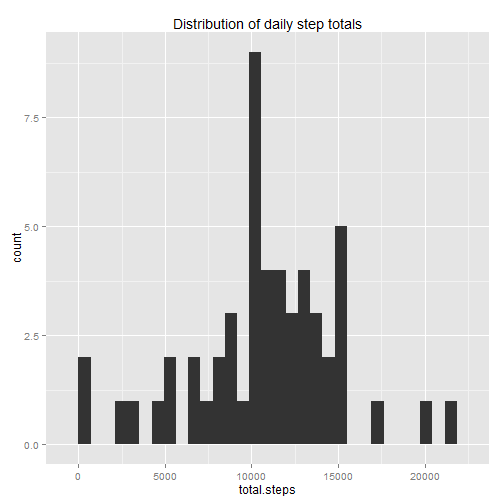
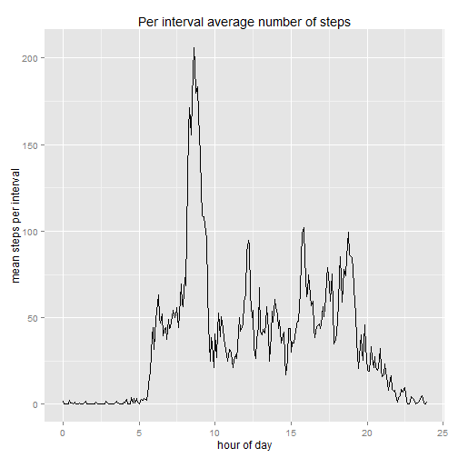
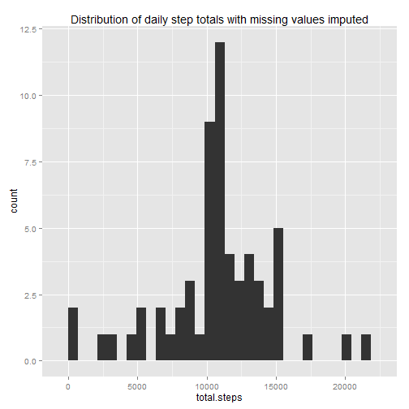
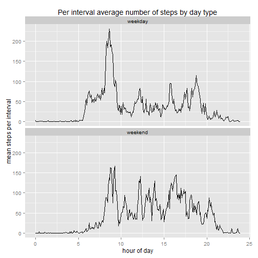

## Loading and preprocessing the data


```r
require(readr)
require(dplyr)
require(ggplot2)
require(lubridate)

activity.df <- read_csv("activity.zip")
```


Here is a quick look at the data.

```r
summary(activity.df)
```

```
##      steps             date               interval     
##  Min.   :  0.00   Min.   :2012-10-01   Min.   :   0.0  
##  1st Qu.:  0.00   1st Qu.:2012-10-16   1st Qu.: 588.8  
##  Median :  0.00   Median :2012-10-31   Median :1177.5  
##  Mean   : 37.38   Mean   :2012-10-31   Mean   :1177.5  
##  3rd Qu.: 12.00   3rd Qu.:2012-11-15   3rd Qu.:1766.2  
##  Max.   :806.00   Max.   :2012-11-30   Max.   :2355.0  
##  NA's   :2304
```

```r
str(activity.df)
```

```
## Classes 'tbl_df', 'tbl' and 'data.frame':	17568 obs. of  3 variables:
##  $ steps   : int  NA NA NA NA NA NA NA NA NA NA ...
##  $ date    : Date, format: "2012-10-01" "2012-10-01" ...
##  $ interval: int  0 5 10 15 20 25 30 35 40 45 ...
```

The interval code appears to denote the number of minutes from the beginning of an hour.
Let's look at the complete unique set of values:

```r
unique(activity.df$interval)
```

```
##   [1]    0    5   10   15   20   25   30   35   40   45   50   55  100  105
##  [15]  110  115  120  125  130  135  140  145  150  155  200  205  210  215
##  [29]  220  225  230  235  240  245  250  255  300  305  310  315  320  325
##  [43]  330  335  340  345  350  355  400  405  410  415  420  425  430  435
##  [57]  440  445  450  455  500  505  510  515  520  525  530  535  540  545
##  [71]  550  555  600  605  610  615  620  625  630  635  640  645  650  655
##  [85]  700  705  710  715  720  725  730  735  740  745  750  755  800  805
##  [99]  810  815  820  825  830  835  840  845  850  855  900  905  910  915
## [113]  920  925  930  935  940  945  950  955 1000 1005 1010 1015 1020 1025
## [127] 1030 1035 1040 1045 1050 1055 1100 1105 1110 1115 1120 1125 1130 1135
## [141] 1140 1145 1150 1155 1200 1205 1210 1215 1220 1225 1230 1235 1240 1245
## [155] 1250 1255 1300 1305 1310 1315 1320 1325 1330 1335 1340 1345 1350 1355
## [169] 1400 1405 1410 1415 1420 1425 1430 1435 1440 1445 1450 1455 1500 1505
## [183] 1510 1515 1520 1525 1530 1535 1540 1545 1550 1555 1600 1605 1610 1615
## [197] 1620 1625 1630 1635 1640 1645 1650 1655 1700 1705 1710 1715 1720 1725
## [211] 1730 1735 1740 1745 1750 1755 1800 1805 1810 1815 1820 1825 1830 1835
## [225] 1840 1845 1850 1855 1900 1905 1910 1915 1920 1925 1930 1935 1940 1945
## [239] 1950 1955 2000 2005 2010 2015 2020 2025 2030 2035 2040 2045 2050 2055
## [253] 2100 2105 2110 2115 2120 2125 2130 2135 2140 2145 2150 2155 2200 2205
## [267] 2210 2215 2220 2225 2230 2235 2240 2245 2250 2255 2300 2305 2310 2315
## [281] 2320 2325 2330 2335 2340 2345 2350 2355
```
The interval codes follow the pattern of using the two least significant digits for the minutes of the hour, from 0 to 55, and the two  most significant digits are used for the hour of the day, from 0 (left off) to 23.
That means that for time series graphs, you have to either use the codes as ordered factors or convert to a common time unit (e.g., hours).

## What is mean total number of steps taken per day?
To obtain meaningful mean and median values for steps taken per day, we must be able to identify
days that had no data and not include them (the sum() function returns zero when no non-NA values are presented and na.rm=TRUE is selected; a daily total of zero will improperly skew the mean and median values).

```r
steps.per.day <- activity.df%>%group_by(date)%>%summarise(had.data=sum(!is.na(steps))>0,
                                                          total.steps=sum(steps,na.rm=TRUE))
```

```
## Note: no visible binding for global variable 'steps' 
## Note: no visible binding for global variable 'steps'
```

```r
ggplot(steps.per.day%>%filter(had.data),aes(total.steps))+geom_histogram()+
    labs(title="Distribution of daily step totals")
```

```
## Note: no visible binding for global variable 'had.data'
```

 

```r
steps.mean.med <- steps.per.day%>%filter(had.data)%>%
    summarise(mean.steps.per.day=round(mean(total.steps)),median.steps.per.day=median(total.steps))
```

```
## Note: no visible binding for global variable 'had.data' 
## Note: no visible binding for global variable 'total.steps' 
## Note: no visible binding for global variable 'total.steps'
```

The mean number of steps per day is 10766,
and the median number of steps per day is 10765.

## What is the average daily activity pattern?
To properly scale the data on a time axis, the interval code must be translated to a time value.

```r
steps.per.interval <- activity.df%>%group_by(interval)%>%
    summarise(mean.per.interval=mean(steps,na.rm=TRUE))%>%
    mutate(interval.hour=interval%/%100+(interval%%100)/60)
```

```
## Note: no visible binding for global variable 'steps'
```

```r
ggplot(steps.per.interval,aes(interval.hour,mean.per.interval))+geom_line()+
    labs(title="Per interval average number of steps",x="hour of day",y="mean steps per interval")
```

 

Identify the interval with the largest average step count and what that count is:


```r
max.count.interval <- steps.per.interval%>%
    filter(mean.per.interval==max(mean.per.interval,na.rm=TRUE))%>%
    mutate(time=paste(interval%/%100,interval%%100,sep=":"))
```

```
## Note: no visible binding for global variable 'mean.per.interval' 
## Note: no visible binding for global variable 'mean.per.interval'
```
The maximum step count average was 206,
which occured during
the interval coded as 835 or 8:35.

## Imputing missing values


```r
missing.values <- activity.df%>%filter(is.na(steps))%>%count%>%rename(missing.values=n)
```

```
## Note: no visible binding for global variable 'steps'
```
There are 2304 missing step counts.

Let's look at the pattern of missing values.
As opposed to having random entries missing, whole days are missing:

```r
(missing.stats <- activity.df%>%group_by(date)%>%summarise(cnt=n(),missing.cnt=sum(is.na(steps)))%>%
    mutate(pct.missing=round(missing.cnt*100/cnt,digits=2))%>%count(pct.missing)%>%
    rename(days=n))
```

```
## Note: no visible binding for global variable 'steps' 
## Note: no visible binding for global variable 'missing.cnt' 
## Note: no visible binding for global variable 'cnt' 
## Note: no visible binding for global variable 'pct.missing'
```

```
## Source: local data frame [2 x 2]
## 
##   pct.missing days
## 1           0   53
## 2         100    8
```
So, there are 53 days missing 0% and
8 days missing 100%.


The strategy employed here to impute missing values is to use the mean count of steps per interval
to maintain
the relative distribution of step counts across intervals.
Conveniently, mean count of steps  per interval is already calculated.

To impute the missing values, first make a copy of the original data:

```r
activity.imp.df <- activity.df
```
Then assign the missing step entries the mean step count for the corresponding interval.

```r
activity.imp.df[is.na(activity.df$steps),"steps"] <-
    left_join(activity.df[is.na(activity.df$steps),],
              steps.per.interval%>%select(mean.per.interval,interval),
              by="interval")$mean.per.interval
```

```
## Note: no visible binding for global variable 'mean.per.interval'
```
Now for the distribution of the data with the missing values imputed:

```r
steps.per.day.imp <- activity.imp.df%>%group_by(date)%>%summarise(had.data=sum(!is.na(steps))>0,
                                                          total.steps=sum(steps,na.rm=TRUE))
```

```
## Note: no visible binding for global variable 'steps' 
## Note: no visible binding for global variable 'steps'
```

```r
ggplot(steps.per.day.imp%>%filter(had.data),aes(total.steps))+geom_histogram()+
    labs(title="Distribution of daily step totals with missing values imputed")
```

```
## Note: no visible binding for global variable 'had.data'
```

 

```r
steps.mean.med.imp <- steps.per.day.imp%>%filter(had.data)%>%
    summarise(mean.steps.per.day=round(mean(total.steps)),
              median.steps.per.day=round(median(total.steps)))
```

```
## Note: no visible binding for global variable 'had.data' 
## Note: no visible binding for global variable 'total.steps' 
## Note: no visible binding for global variable 'total.steps'
```
Using the data set with missing values imputed, the mean number of steps per day  is 10766,
and the median number of steps per day is 10766.
 
For the imputed data set, both the histogram (distribution) and mean and median of daily step totals are the same as with the original data set with the missing values ignored when calculating the
summary statistics.
It is not unreasonable for the distribution and summary statistics to be the same since summary statistics were used to fill in the missing values.

## Are there differences in activity patterns between weekdays and weekends?
Lets add a new column to the imputed data set that indicates whether the day is a weekday or weekend.

```r
activity.imp.wd.df <- activity.imp.df%>%
    mutate(wd=as.factor(ifelse(wday(date,label=TRUE)%in%c("Sun","Sat"),"weekend","weekday")))
```
Now, aggregate statistics by day type and interval:

```r
steps.per.interval.daytype <- activity.imp.wd.df%>%group_by(wd,interval)%>%
    summarise(mean.per.interval=mean(steps,na.rm=TRUE))%>%
    mutate(interval.hour=interval%/%100+(interval%%100)/60)
```

```
## Note: no visible binding for global variable 'wd' 
## Note: no visible binding for global variable 'steps'
```
And plot it:

```r
ggplot(steps.per.interval.daytype,aes(interval.hour,mean.per.interval))+facet_wrap(~wd,ncol=1)+
    geom_line()+
    labs(title="Per interval average number of steps by day type",x="hour of day",
         y="mean steps per interval")
```

 

Yes, the weekday pattern is different from the weekend pattern, and the difference is that
activity starts and ends earlier on weekdays than on weekends, which agrees with common experience.
